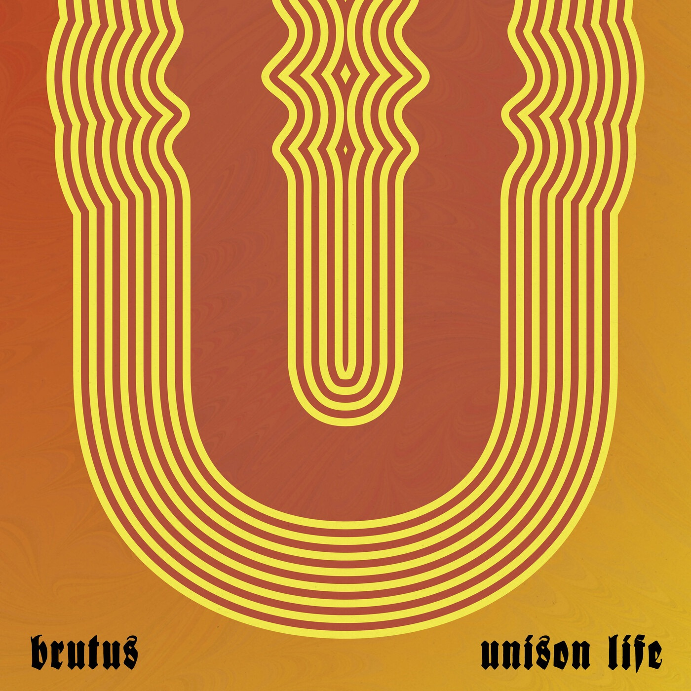

+++
title = 'Favourite Albums of 2022'
date  = '2022-12-24T20:18:00-05:00'
draft = true
+++

It's that time of year again, where I attempt to rank and list my favourite new albums of the year. I tend to have a
bit of a tough time with these, cause I generally hate rating things beyond a 'yes / meh / no' scale. Oh well. the
usual warnings apply; I'm not a music reviewer, this is all purely subjective, I might use naughty words, etc.
Without further ado, my Favourite Albums of 2022:

---

## #10 Thick, _Happy Now_
19 August - Indie Rock, Pop Punk

My first introduction to this Brooklyn-based trio was the opening for Dream Wife in NYC as the latter toured in support
of their first album. I bought their two home-burned EPs at that show, and I'm excitied to say that their second
full-length album carries on what first caught my interest: garage-rock riffs, relatable punk-rock lyrics, and just a
damn good time.

---

## #9 - Mitski, _Laurel Hell_
04 February - Synthpop, Art Pop

I have to be honest: I'm a little late to the party on Mitski. She was one of those artists that I kept hearing about
and intending to listen to, but never got around to it. The release of the first single "Working for the Knife"
late last year is what finally inspired me to put her music on, and it's been a staple for me ever since. _Laurel Hell_
is no execption, a continued refinement of Mitski's songwriting prowess as she branches into more synth-heavy production
than her previous folk and indie rock influences.

---

## #8 - Shaam Larein, _Sticka en kniv i världen_
09 December - Gothic Rock, Doom Metal

Mood. So much Mood. The follow up to Shaam Larein's 2020 debut _Sculpture_ hits all the right notes, succeeding in
building a dark and spooky atmosphere that grabs on and does not let go. 

---

## #7 - Messa, _Close_
11 March - Doom Metal, Stoner Rock

---

## #6 - Flower Face, _The Shark in Your Water_
27 May - Indie Pop, Dream Pop

---

## #5 - shedfromthebody, _Destruction / Breathing / Healing_
14 November - Post-metal, Shoegaze

---

## #4 - Brutus, _Unison Life_
21 October - Post-hardcore, Post-metal

---

## #3 - Silversun Pickups, _Physical Thrills_
19 August - Indie Rock, Alternative Rock

Text

---

## #2 - Rolo Tomassi, _Where Myth Becomes Memory_
04 February - Post-metal, Post-hardcore

Following up on 2019's _Time Will Die and Love Will Bury It_, Rolo Tomassi

---

## #1 - Haru Nemuri, _Shunka Ryugen_ 
22 April - J-rock, Art Pop

This one kinda came out of nowhere. I've never really gotten into J-pop/rock/etc., for no reason other than I haven't
taken the time to listen to it. Nemuri's first album, 2018's _Haru to Shura_, popped up in my recommendations on 
Spotify in early April, so I gave it a listen and enjoyed it. A few weeks later when _Shunka Ryugen_ showed up in my
new releases, I had all but forgotten about the first album and was blown away.

With songs ranging from hip-hop to post-hardcore, Nemuri showcases her many talents across the album, allowing herself
the freedom to experiment with different sounds and genres. Although not necessarily as 'cohesive' as her first effort,
the variety on display never left me bored.

---
And there we have it. Top albums of the year, displayed and editorialized for your pleasure. Honourable mentions and 
additional stats follow.
